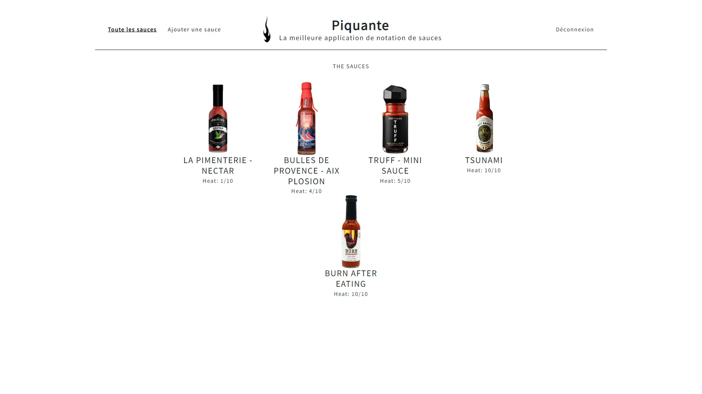

# Projet 6 : Sauce piquante

## Contexte :

Les sauces piquantes sont de plus en plus populaires, c'est pourquoi la marque de condiments à base de piment Piiquante souhaite développer une application web de critique des sauces piquantes .

## Objectifs :

Construire une API sécurisée avec ses models, controllers et routes. Les utilisateurs de l'application doivent pouvoir créer de nouvelles sauces, modifier ou supprimer leur sauce, ainsi que liker ou disliker toutes les sauces créées.

## Langages utilisés :

Node.js / Express.js / MongoDB

## Pour faire fonctionner le projet vous devez installer :

### Backend

-Node.js
-Démarrage du serveur avec 'nodemon server' ou 'npm start'
Le serveur doit fonctionner sur "localhost" avec le port par défaut "3000".

### Frontend

- [NodeJS](https://nodejs.org/en/download/) en version 12.14 ou 14.0
- [Angular CLI](https://github.com/angular/angular-cli) en version 7.0.2.
- [node-sass](https://www.npmjs.com/package/node-sass) : attention à prendre la version correspondante à NodeJS. Pour Node 14.0 par exemple, installer node-sass en version 4.14+.

### Development server

Démarrer ng serve pour avoir accès au serveur de développement. Rendez-vous sur http://localhost:4200/. L'application va se recharger automatiquement si vous modifiez un fichier source.

- Portfolio :''
